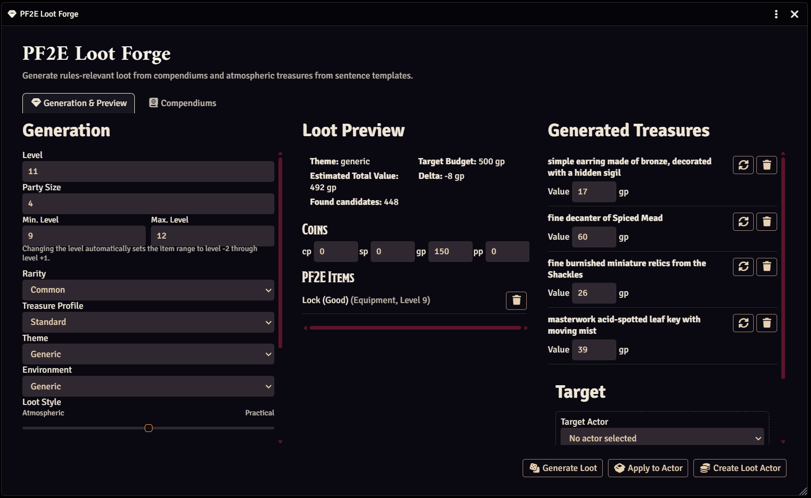
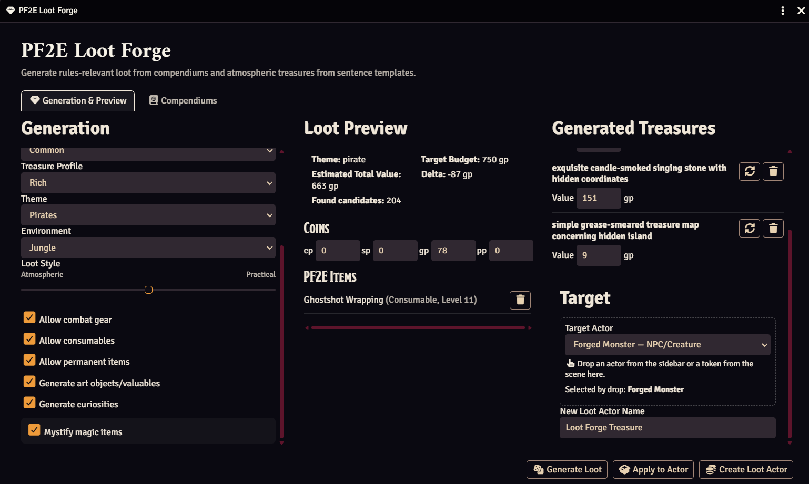

# PF2E Loot Forge

A Foundry VTT module for Pathfinder 2e Remastered that generates thematic treasure, valuables, and loot inventories for NPCs, encounters, dungeons, and rewards.

PF2E Loot Forge helps Game Masters quickly create believable treasure hoards and inventories without manually assembling dozens of items.


## Part of the Forge Suite

**Loot Forge** is part of the **Forge Suite**, a growing collection of Foundry VTT modules and add-ons built for the busy Game Master. The suite is designed to reduce preparation and bookkeeping, make common GM tasks easier, and add useful tools that help make running and playing campaigns smoother and more enjoyable.

An overview of the Forge Suite, its modules, add-ons, and shared documentation is available here:

**Forge Suite:** https://github.com/crypto-vbrthr/pf2e-forge-suite


---

## Main Window





## Features

### Generated Treasure

Generate thematic treasure based on:

* Party or encounter level
* Treasure budget
* Treasure profile
* Theme
* Environment
* Rarity

Generated treasures include:

* Art objects
* Jewelry
* Collectibles
* Curiosities
* Documents
* Craftsmanship items
* Textiles
* Instruments
* Beverages
* Statues
* Coins
* PF2E items

---

### Strong Theme Identity

Themes significantly influence generated treasures.

Examples:

* Dragon Hoard
* Dwarven Ruin
* Pirate Hideout
* Temple
* Mage Tower
* Alchemist Laboratory
* Cultist Lair
* Undead Crypt
* Bandit Camp
* Goblin Den

A Dragon Hoard feels different from a Temple or Pirate Hideout, even at the same level and budget.

---

### Environment Integration

Environments influence treasure composition and item conditions.

Examples:

* Forest
* Mountains
* Cave
* Swamp
* Desert
* Coast
* Jungle
* Arctic
* Underground
* Volcanic
* Ruined City

---

### Loot Actor Creation

Create a dedicated loot actor containing generated treasure.

Perfect for:

* Dungeon rewards
* Treasure rooms
* Hidden caches
* Quest rewards

---

### Add Loot to Existing Actors

Generate treasure directly into existing actors.

Useful for:

* NPC inventories
* Merchants
* Bosses
* Faction leaders
* Named enemies

---

### Drag & Drop Target Selection

Quickly select a target actor by dragging:

* An Actor from the Actor Directory
* A Token from the scene

directly onto the Target Actor field.

This makes inventory generation fast even in campaigns with hundreds of NPCs.

---

### Optional Item Forge Integration

If **PF2E Item Forge** is installed and active, Loot Forge can delegate construction of the individual loot objects to it. The integration is optional and can be enabled per generation request or as a world default.

Loot Forge continues to own the *loot composition*:

* Treasure budgets and budget caps
* How many practical items and treasure objects are requested
* Theme and environment selection
* Coins
* Applying the completed loot result to actors

Item Forge can take over the *individual item construction*:

* Weapons and armor
* Consumables
* Permanent and supported magic-item families
* Art objects and valuables
* Curiosities and books/documents
* Jewelry, ceremonial objects, luxury goods, tableware, gemstones, and beverages

Loot Forge passes its item-level range, rarity ceiling, selected compendiums, theme, theme tags, environment, target value, and caller metadata to Item Forge. For magical items the Loot Forge theme is translated to an appropriate Item Forge magic theme where possible. For generated treasure it is translated into Item Forge treasure styles and motifs, so a pirate cache, temple treasury, dwarven ruin, dragon hoard, and similar themes remain meaningfully distinct inside Item Forge rather than being decorated after generation.

The Loot Forge budget cap still applies to the returned results. Item Forge generated treasure values are normalized to GP for Loot Forge's editable preview while preserving their exact total value. Re-rolling an Item Forge treasure in the preview delegates the replacement to Item Forge again and preserves its treasure category and theme context.

If Item Forge is not installed, inactive, or not selected, Loot Forge uses its existing compendium and native atmospheric treasure generation paths unchanged. If an older Item Forge API is present without treasure-generation capability, only the treasure portion falls back to Loot Forge.

The integration is deliberately runtime-only: Loot Forge does not statically import Item Forge code and therefore has no hard dependency on it.

---

### Localization

Fully localized in:

* English
* German

---

## Usage

### Create a Loot Actor

1. Open Loot Forge.
2. Configure level, theme, environment, and treasure settings.
3. Generate a preview.
4. Create a new loot actor.

### Add Loot to an Existing Actor

1. Open Loot Forge.
2. Select a target actor.
3. Generate treasure.
4. Apply loot to the actor.

### Drag & Drop Workflow

1. Open Loot Forge.
2. Drag an actor from the sidebar or a token from the scene onto the Target Actor field.
3. Generate treasure.
4. Apply loot.

---


### Remembered Generation Settings

The standalone Loot Forge remembers the last used level, party size, and minimum/maximum item level on each client.

Embedded editors created by other modules remain host-controlled by default and do not automatically overwrite these standalone preferences or the world's enabled compendium selection.

### Fixed Budget

Instead of using the automatically calculated treasure budget, you can enable **Use fixed budget** and enter an exact GP value.

The fixed budget replaces only the target-budget calculation. Theme, environment, loot style, category weighting, and the rest of the generation pipeline continue to work normally.

Minimum and maximum item level control the eligible item-level range only. They do not change the treasure level or budget.


## Embedded Loot Forge API

PF2E Loot Forge can be embedded inside other Foundry VTT modules. The embedded editor owns loot configuration, generation, preview editing, and compendium selection. Actions that persist the result, such as applying loot to an Actor or creating a Loot Actor, deliberately remain the responsibility of the host module.

```js
const lootForge = game.modules.get("pf2e-loot-forge")?.api;

// Optional provider diagnostics
lootForge.getItemForgeIntegrationStatus();
// => { installed, active, available, apiVersion }

const editor = lootForge.createEmbeddedEditor({
  initialConfig: {
    level: 8,
    theme: "generic",
    environment: "generic",
    compendiums: [
      "pf2e.equipment-srd",
      "my-module.custom-items"
    ]
  },
  // Default is false: source selection remains local to this editor/host.
  persistSourceSelection: false,
  onGenerate: state => {
    console.log("Generated loot", state.loot);
  }
});

await editor.render(containerElement);
```

The embedded editor contract currently has version `2`:

```js
lootForge.embeddedContractVersion; // 2
```

### Host-local compendium selection

Embedded editors keep their compendium selection local by default. The initial selection is inherited from the Loot Forge world setting unless `initialConfig.compendiums` is provided, but changes made inside the embedded editor do **not** modify `enabledCompendiums`.

This is intended for hosts such as Creature Forge or Encounter Forge which need their own source profile without changing the standalone Loot Forge configuration.

```js
const editor = lootForge.createEmbeddedEditor({
  initialConfig: {
    level: 10,
    compendiums: ["pf2e.equipment-srd", "creature-pack.loot"]
  }
});

editor.getCompendiums();
// => ["pf2e.equipment-srd", "creature-pack.loot"]

await editor.setCompendiums(["creature-pack.loot"], { render: false });
```

The host-local selection is included in `getConfig()` and `getState().config`, and it is passed to every generation request including Item Forge delegation.

The standalone Loot Forge opts into `persistSourceSelection: true`, preserving its existing world-level source-selection behavior. An external host can explicitly request the same behavior, but should normally leave it disabled.

Available editor methods:

* `render(containerElement)`
* `refresh()`
* `getConfig()`
* `setConfig(partialConfig, options)`
* `getCompendiums()`
* `setCompendiums(compendiums, options)`
* `getState()`
* `getLoot()`
* `getGeneratedResult()`
* `syncFromForm()`
* `generate(optionalConfigOverride)`
* `destroy()`

The embedded editor intentionally does **not** expose `addLootToActor()` or `createLootActorWithLoot()`. A host which wants those behaviors can use the existing Loot Forge API methods explicitly after retrieving the generated loot.

Example host-controlled application:

```js
editor.syncFromForm();
const loot = editor.getLoot();

await lootForge.addLootToActor(targetActor, loot, {
  mystifyMagicItems: editor.getConfig().mystifyMagicItems
});
```

This separation allows modules such as campaign, encounter, creature, or reward tools to reuse Loot Forge without duplicating its generation UI or forcing a specific persistence workflow.

---

## Automated Tests

The repository includes automated regression and contract tests for:

* Embedded editor / host-container responsibility boundaries
* Public embedded API contract
* German and English localization coverage
* JSON generator data integrity
* Zero-GP item filtering, including the cursed-item exception
* Protection against wildly over-budget compendium item selection
* Optional Item Forge provider detection and API delegation
* Item Forge source-policy, rarity, level-range, and budget-cap integration

Run the full test suite with:

```bash
npm test
```

The test suite uses Node.js' built-in test runner and requires no additional test dependencies.

---

## Compatibility

* Foundry VTT V14
* Pathfinder 2e Remastered

---

## Installation

Install through Foundry VTT using the module manifest URL.

Alternatively:

1. Download the latest release.
2. Extract it into your Foundry `Data/modules` directory.
3. Enable the module in your world.

---

## Roadmap

Planned future improvements include:

* Treasure profiles
* Merchant inventory generation
* Settlement loot generation
* Quest reward generation
* Additional themes and environments

---

## Support

Bug reports, feature requests, and contributions are welcome through GitHub Issues.

---

## License

MIT License

Copyright (c) 2026 crypto-vbrthr
